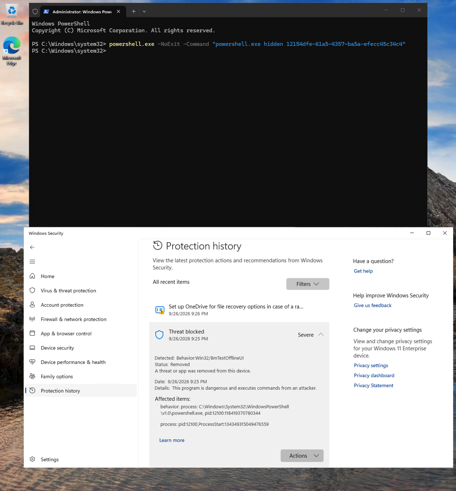
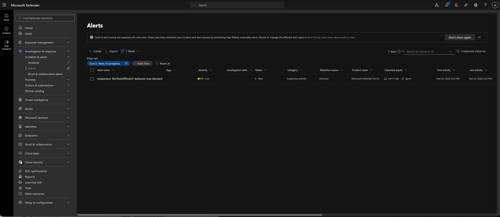
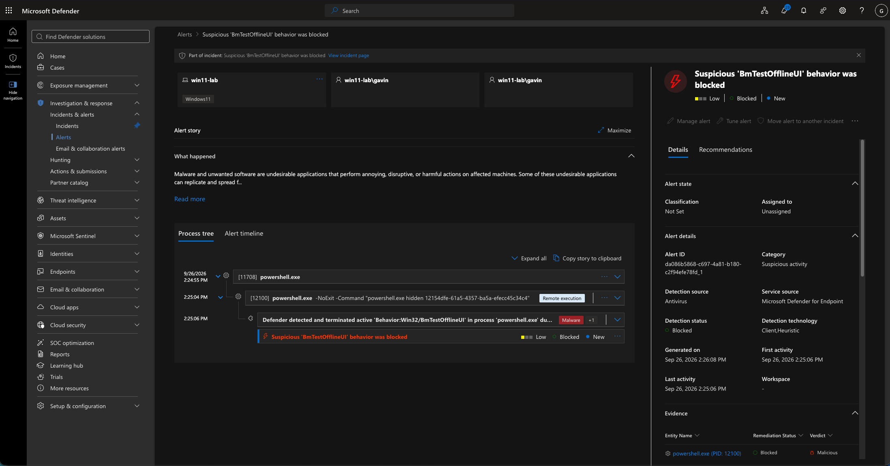
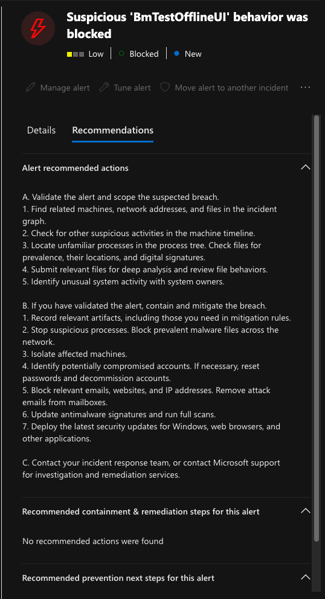
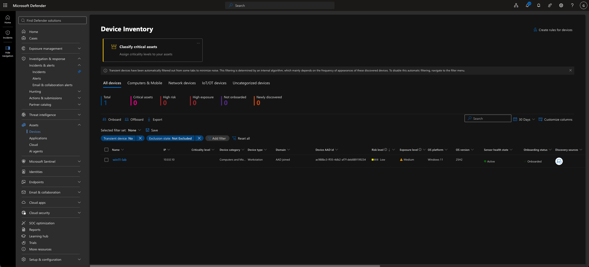
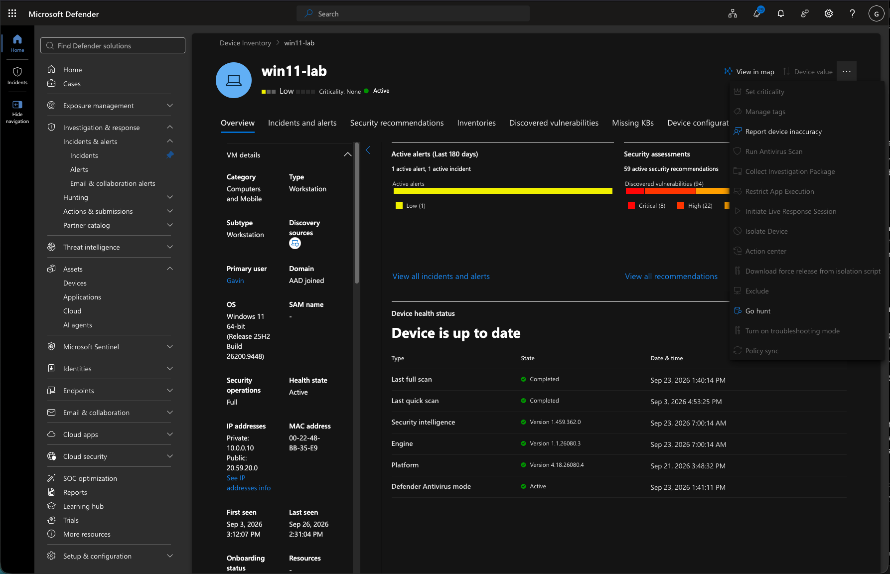
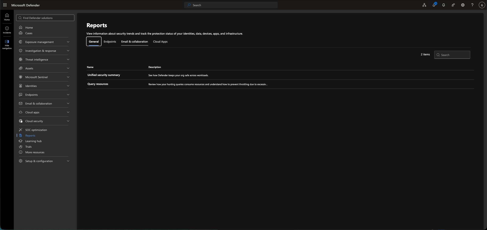
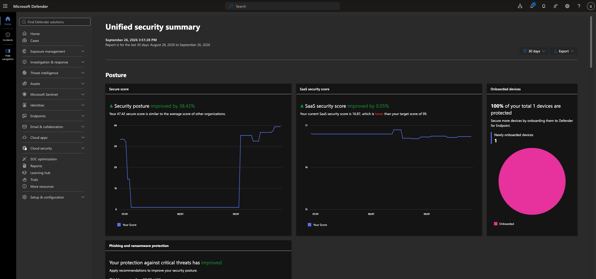

# Defender Alert Investigation Evidence

This folder contains evidence from a controlled Microsoft Defender for Endpoint alert investigation performed in an authorized Windows 11 lab environment.

The investigation followed the activity from local detection through alert review, process analysis, containment evaluation, and organization-wide security reporting.

## Related Baseline Evidence

Before the controlled test, the `win11-lab` device overview reported no active alerts or incidents. This earlier screenshot provides the baseline used to compare the device state before and after the detection.

## Screenshot 1: Controlled Defender Test and Local Block

A controlled PowerShell test was executed on `win11-lab`. Windows Security detected `Behavior:Win32/BmTestOfflineUI`, classified it as Severe, removed it, and recorded the affected PowerShell process.

The activity was intentionally generated in the authorized lab to validate Defender detection and reporting.

## Screenshot 2: Defender Alert Queue

Microsoft Defender created the alert **Suspicious 'BmTestOfflineUI' behavior was blocked**.

The alert showed:

* Severity: Low
* Status: New
* Category: Suspicious activity
* Detection source: Antivirus
* Impacted asset: `win11-lab`

This confirmed that the locally blocked activity was reported to the centralized Defender portal.

## Screenshot 3: Alert Process Tree

The alert details showed the PowerShell process chain associated with the controlled test.

Defender reported that it detected and terminated active `Behavior:Win32/BmTestOfflineUI` activity in `powershell.exe`. The evidence was assigned a malicious verdict while the alert remained Low severity and Blocked.

The process tree connected the endpoint activity to the centralized alert and provided the process context needed for investigation.

## Screenshot 4: Investigation and Containment Guidance

Defender displayed general investigation guidance, including:

* Validate the alert and determine its scope
* Review related machines, network addresses, and files
* Check the machine timeline
* Investigate unfamiliar processes
* Review user activity with system owners
* Isolate affected machines when containment is necessary
* Update security software and run scans

The alert-specific containment section stated that no recommended actions were found. Therefore, the response decision required analyst review rather than relying on an automatically generated containment action.

## Screenshot 5: Device Risk and Exposure Status

The Device Inventory page showed one onboarded Windows 11 device.

`win11-lab` was displayed with:

* Risk level: Low
* Exposure level: Medium
* Sensor health state: Active
* Onboarding status: Onboarded

This provided additional context for deciding whether stronger containment was justified.

## Screenshot 6: Device-Isolation Action Unavailable

After the alert, the device overview showed one active alert and one active incident associated with `win11-lab`.

The device response menu was reviewed, but **Isolate Device** and several other response actions were unavailable in the current session. No isolation action was performed.

Because the activity was a controlled test, Defender had blocked the behavior, and the device risk remained Low, the endpoint was not isolated.

## Screenshot 7: Unified Security Summary Selection

The Defender Reports page was reviewed, and **Unified security summary** was selected to examine security trends and protection status beyond the individual endpoint.

## Screenshot 8: Organization-Wide Security Posture Summary

The Unified security summary provided an organization-wide view of the authorized lab tenant for the previous 30 days.

The visible posture summary showed:

* Secure Score: `47.42`
* Security posture improvement: `38.43%`
* SaaS security score: `16.87`
* SaaS security-score improvement: `0.05%`
* One onboarded device
* `100%` of the tenant’s device inventory protected

This report represented the tenant’s organization-wide security posture rather than only the state of `win11-lab`.

## PDF 9: Complete Unified Security Summary

[View the complete organization-wide Unified security summary](09-organization-wide-unified-security-summary.pdf)

The exported eight-page report provided organization-wide information for the lab tenant across:

* Posture
* Protection
* Detection
* Investigation and response
* Optimizations

The report supplemented the endpoint investigation by placing the controlled alert and device state within the tenant’s broader Defender reporting context.
