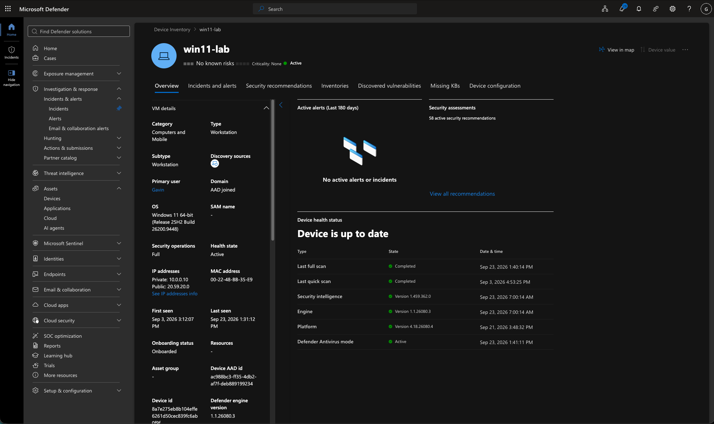
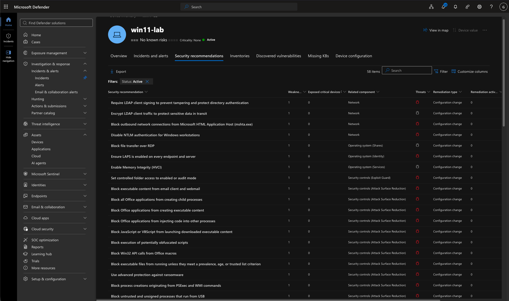
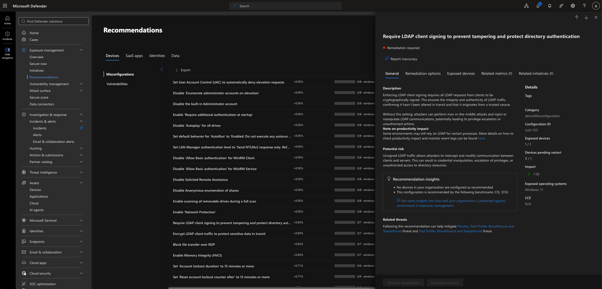
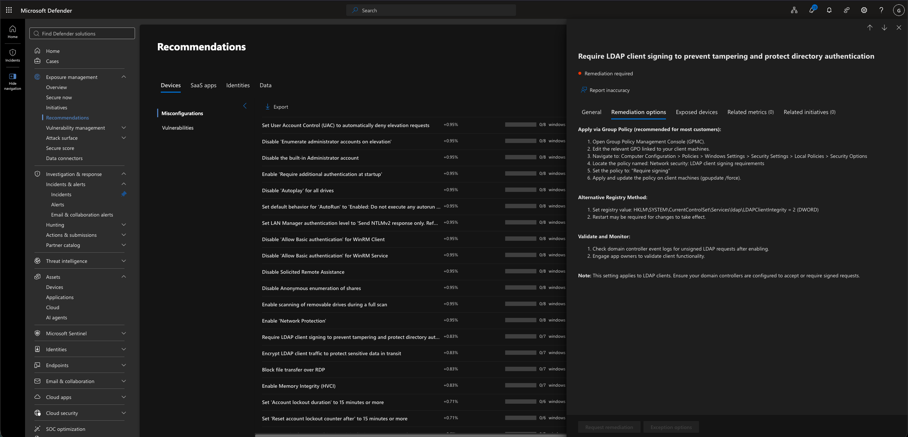
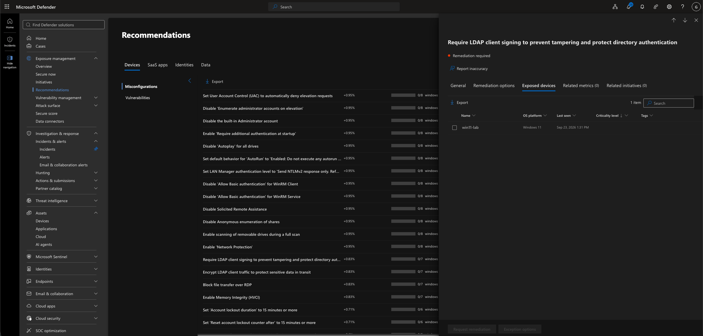
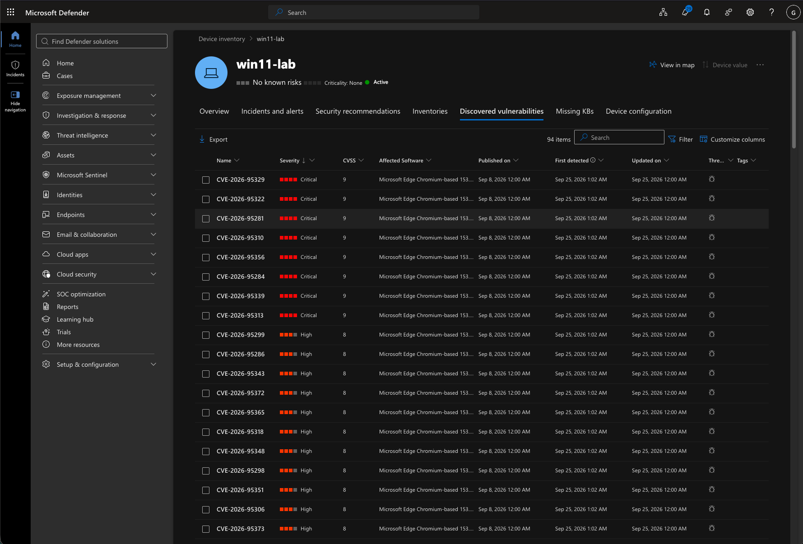
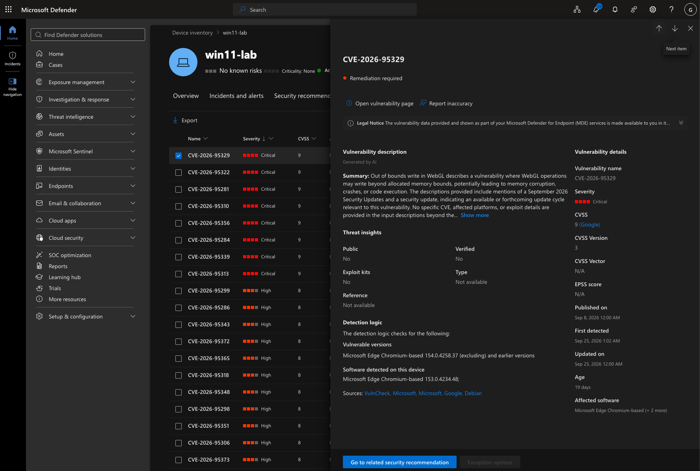
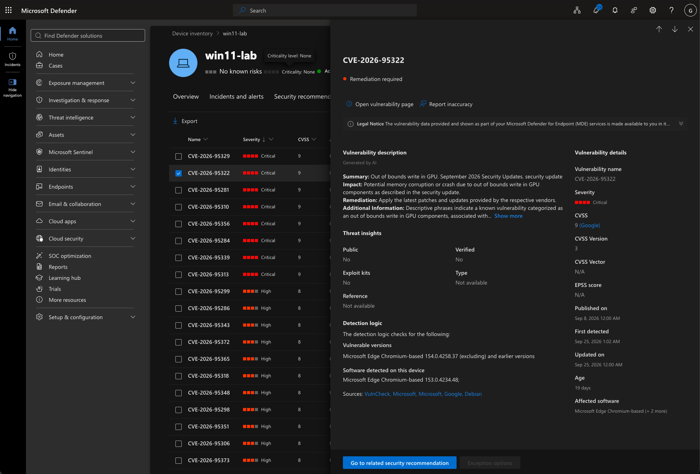
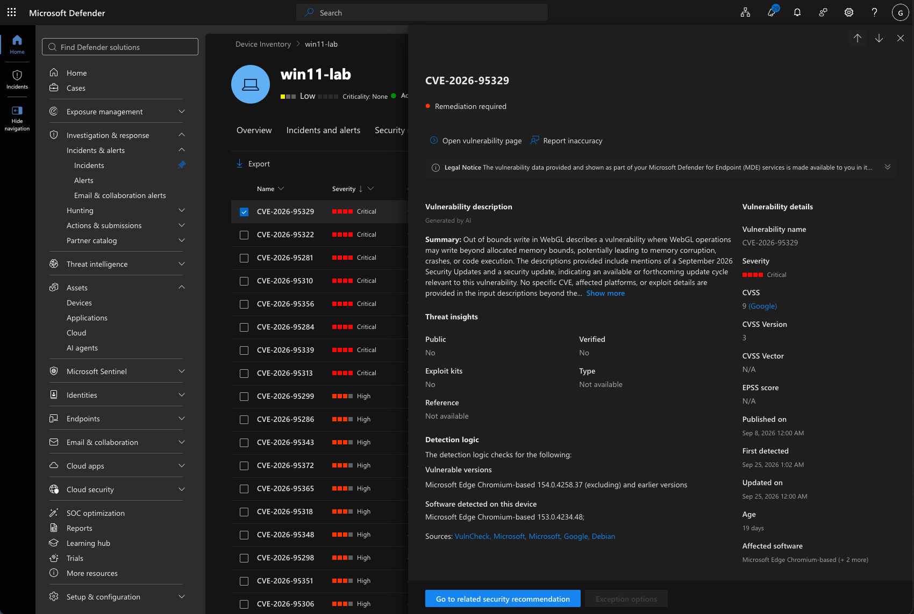
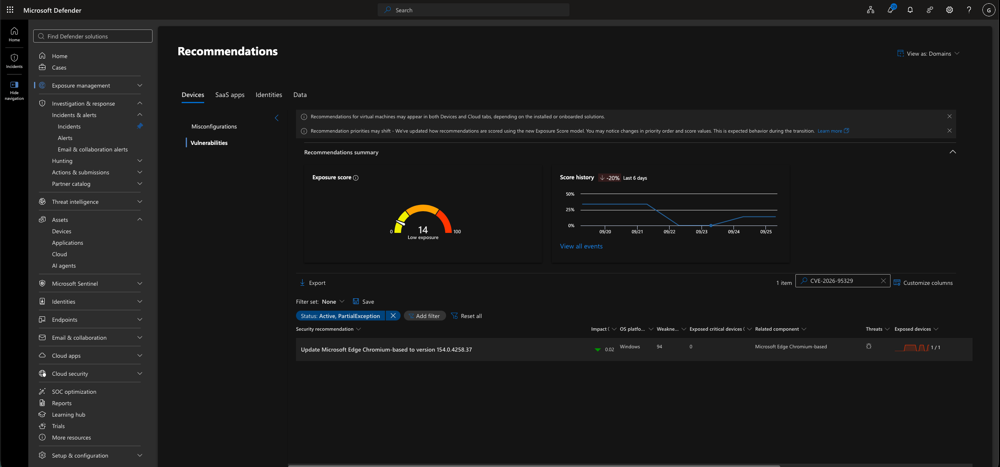

# Endpoint Security Posture Evidence

This folder contains evidence collected from an authorized Microsoft Defender for Endpoint lab environment. The screenshots document the security posture, active recommendations, exposed-device validation, discovered vulnerabilities, and remediation guidance for `win11-lab`.

## Screenshot 1: Defender Device Security Posture

**Timestamp:** September 24, 2026 at 4:09:57 PM



The device overview identified `win11-lab` as active and onboarded to Microsoft Defender for Endpoint. The page reported no active alerts or incidents and displayed 58 active security recommendations. It also showed the device-health components as up to date.

## Screenshot 2: Active Security Recommendations

**Timestamp:** September 24, 2026 at 4:11:44 PM



The Security recommendations page listed 58 active recommendations for `win11-lab`. These included configuration weaknesses involving authentication, network protections, attack-surface reduction, and operating-system security controls.

The LDAP client-signing recommendation was selected for further investigation.

## Screenshot 3: LDAP Client-Signing Risk Details

**Timestamp:** September 24, 2026 at 4:40:52 PM



Microsoft Defender recommended requiring LDAP client signing to protect directory-authentication traffic from tampering.

The recommendation showed:

* Remediation required
* One of one applicable devices exposed
* Potential Secure Score impact of `+7.00`
* `win11-lab` running Windows 11 as the exposed endpoint

The risk description explained that unsigned LDAP traffic could permit interception or modification of communications between clients and directory services.

## Screenshot 4: LDAP Client-Signing Remediation Options

**Timestamp:** September 24, 2026 at 4:40:57 PM



The remediation guidance provided procedures for requiring LDAP client signing through Group Policy or the Windows Registry.

The Group Policy method referenced:

```text
Computer Configuration
└── Policies
    └── Windows Settings
        └── Security Settings
            └── Local Policies
                └── Security Options
```

The applicable policy was **Network security: LDAP client signing requirements**, with **Require signing** presented as the recommended setting.

These remediation options were reviewed but were not deployed during this assessment.

## Screenshot 5: LDAP Client-Signing Exposed Device

**Timestamp:** September 24, 2026 at 4:41:27 PM



The Exposed devices tab confirmed that `win11-lab` was the endpoint associated with the LDAP client-signing recommendation.

## Screenshot 6: Discovered Vulnerabilities Overview

**Timestamp:** September 26, 2026 at 1:56:49 PM



The Discovered vulnerabilities page reported 94 vulnerability records associated with `win11-lab`. The results included multiple vulnerabilities categorized as Critical or High severity.

The list was used to select individual vulnerabilities for technical review and prioritization.

## Screenshot 7: CVE-2026-95329 Vulnerability Details

**Timestamp:** September 26, 2026 at 2:02:22 PM



Microsoft Defender classified CVE-2026-95329 as Critical with a CVSS score of `9`.

The vulnerability involved an out-of-bounds write affecting WebGL and could potentially result in memory corruption, application crashes, or code execution.

Defender detected Microsoft Edge Chromium-based version `153.0.4234.48` on the device. The portal identified versions earlier than `154.0.4258.37` as vulnerable.

## Screenshot 8: CVE-2026-95322 Vulnerability Details

**Timestamp:** September 26, 2026 at 2:02:36 PM



Microsoft Defender classified CVE-2026-95322 as Critical with a CVSS score of `9`.

The vulnerability involved an out-of-bounds write affecting GPU components, with possible effects including memory corruption or application crashes.

The affected device was running Microsoft Edge Chromium-based version `153.0.4234.48`, while Defender identified versions earlier than `154.0.4258.37` as vulnerable.

## Screenshot 9: Prioritized CVE Threat Insights

**Timestamp:** September 26, 2026 at 3:06:18 PM



A follow-up review of CVE-2026-95329 showed that Defender had not identified:

* Public exploitation
* Verified exploitation
* Available exploit kits

These indicators were considered alongside the Critical severity and CVSS score rather than using severity alone to determine remediation priority.

## Screenshot 10: Microsoft Edge Update Recommendation

**Timestamp:** September 26, 2026 at 3:06:37 PM



The related security recommendation instructed administrators to update Microsoft Edge Chromium-based to version `154.0.4258.37`.

The recommendation showed:

* One exposed device out of one applicable device
* 94 associated weaknesses
* Recommendation impact of `0.02`
* Organization exposure score of `14`, categorized as Low

This connected the individual CVE findings to a specific software-update recommendation.

